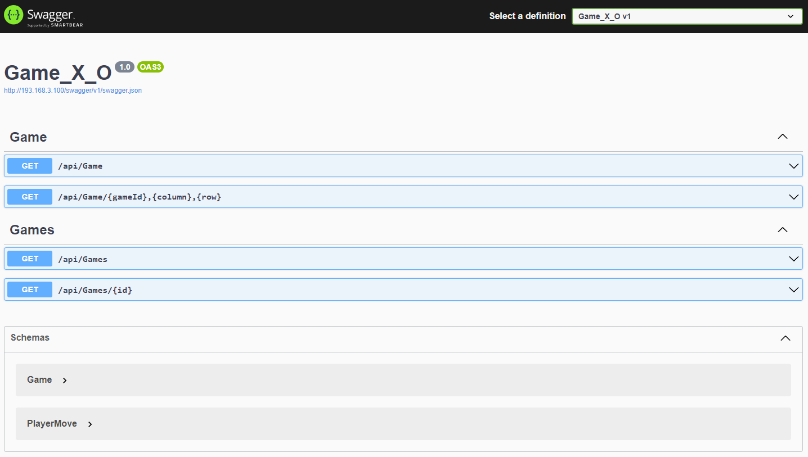

# Реализация REST API игры в крестики нолики C#

## Описание

   1. /api/Game - Метод создает новою игру, просто отпровляешь запрос и игра создается сама

  
   2. /api/Game/{gameId},{column},{row} - с помощью этого метода происходит игра. Метод
      принимает 3 параметра 1- номер игры, 2 - колонка, 3 - строка. Колонка и строка позиционируют ход игрока.  
  
    {
     "id": 1,
     "playerTurn": 2, -  показывает какой игрок должен ходить (в данном примере игрок номер 2)
     "winner": 0, - показывает какой игрок выиграет 
     "stage": "active", - стадия игры
     "error": "not",
     "playerMoves": [ -  история ходов игроков 
       {
         "id": 1, 
         "player": 1,
         "column": 1,
         "row": 1,
         "value": "O"
       }
     ]
    }
   
   3. /api/Games - Метод позволяет посмотреть историю всех игр и ходов 
   4. /api/Games/{id} - Метод позволяет посмотреть выбранную игру детально 

###   Все данные хранятся в БД PostgreSQL

## пример игры 
  С Помощью метода  “/api/Game ”  создаем игру.  Далее с помощью метода /api/Game/1,1,1 делаем ход, первым всегда ходит игрок 1, в данном примере игра номер 1 и в ячейку 1,1 ставим “О”.
  Следующий ходит игрок 2, он ставит “X” и так далее пока кто нибудь не выиграет или будет ничья.
  В поле "playerTurn" можно посмотреть кто ходит.

###  deploy производится через docker-compose

